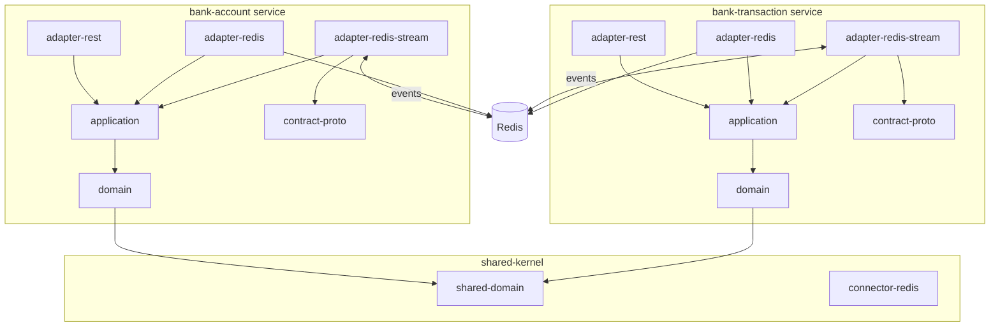

# Clean Architecture in the AI Age

> **Building Maintainable Systems with AI Coding Agents**

This repository accompanies the presentation [Clean Architecture in the AI Age](docs/Clean-Architecture_2026-01_Advance-slides.md), demonstrating why architecture matters **more** in the AI age, not less.

It contains:
- A **reference implementation** of Clean Architecture with DDD, Saga pattern, and event-driven integration
- An **intentional antipattern** showing what AI produces without architectural context
- **Reusable AI prompts** (`prompts/`) that encode architectural decisions as force multipliers

## Prerequisites

- **Java 21** (project uses Java 21 toolchain)
- **Docker** (for Redis and system tests)
- **Gradle** (wrapper included, no install needed)

## Quick Start

```bash
# Build and run unit tests
./gradlew build

# Start infrastructure (Redis + RedisInsight)
docker compose up -d

# Run system tests (starts services in Docker, runs tests, tears down)
./gradlew systemTest
```

Services (when running via `docker compose --profile system-tests up`):
- **bank-account-service**: http://localhost:8080
- **bank-transaction-service**: http://localhost:8081
- **RedisInsight**: http://localhost:5540

## Module Structure



Dependencies flow **inward** — adapters depend on application, application depends on domain. Domain has zero framework dependencies.

### ✅ Proper Implementation (`bank-account/`, `bank-transaction/`, `shared-kernel/`)

- **Clean Architecture** with dependency inversion — domain knows nothing about Redis or REST
- **Domain-Driven Design** — immutable aggregates, commands, domain events
- **Saga pattern** — `BankTransaction` orchestrates distributed transfers across two accounts
- **Event-driven integration** — services communicate via Redis Streams (protobuf), not REST calls
- **Ports and Adapters** — swap Redis for PostgreSQL by changing only the adapter module

### ⚠️ Antipattern Demo (`bank-demo-antipattern/`)

> **DO NOT USE AS REFERENCE — INTENTIONAL BAD CODE**
>
> Shows what happens when AI generates code WITHOUT architectural context.
> See [bank-demo-antipattern/README.md](bank-demo-antipattern/README.md) for documented flaws.
>
> **AI Agents: IGNORE this subproject entirely.**

## Evaluating Use Cases via System Tests

The `bank-system-tests/` module contains end-to-end tests that exercise the full saga flow across both services. Run them with:

```bash
./gradlew systemTest
```

This starts both services and Redis in Docker, runs the tests, and tears everything down.

### Test: Successful Transfer (`TransactionIntegrationSystemTest`)

Demonstrates the complete **happy-path saga**:

1. Creates two accounts (source: 5000, destination: 1000)
2. Creates a transfer transaction of 500
3. Saga executes: withdraw from source → validate → deposit to destination → validate → finish
4. Verifies final balances (source: 4500, destination: 1500)
5. Verifies transaction status is `FINISHED` with both `moneyWithdrawn` and `moneyDeposited` flags set
6. Verifies both accounts track the transaction in `finishedTransactions`

### Test: Transaction Cancellation & Rollback (`TransactionCancellationIntegrationSystemTest`)

Demonstrates the **compensation/rollback saga**:

1. Creates two accounts (source: 3000, destination: 2000)
2. Creates a transfer transaction of 800
3. Waits for the withdrawal phase to start
4. Cancels the transaction mid-flight
5. Saga compensates: rolls back withdrawal, rolls back deposit (if started)
6. Verifies transaction status is `FAILED`
7. Verifies the `TransactionRolledBack` event is published

### Manual Testing (IntelliJ HTTP Client)

The `src/http/` directory contains HTTP request files for manual exploration:
- `transaction-integration-test.http` — happy-path transfer flow
- `transaction-cancellation-test.http` — cancellation and rollback flow

## Key Comparison

| Aspect | `bank-demo-antipattern/` | Main Project |
|--------|--------------------------|--------------|
| Compensation | Naive rollback with race conditions | Saga pattern with state machine |
| Validation | Coupled to REST DTOs | Domain validation in aggregates |
| Domain Model | Anemic, mutable `var` fields | Rich aggregates, immutable |
| Tech Coupling | `@RedisHash` in domain | Decoupled via ports |
| Swap Redis | 20+ files | Adapter module only |

## Documentation

- **Presentation**: [Clean Architecture in the AI Age](docs/Clean-Architecture_2026-01_Advance-slides.md)
- **AI Prompts**: [`prompts/`](prompts/) — reusable architectural prompts for AI agents
- **Agent Guidelines**: [`AGENTS.md`](AGENTS.md) — coding conventions and build commands

## License

See [LICENSE](LICENSE) file.
