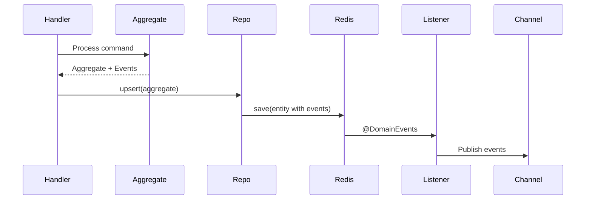

# Clean Architecture in the AI Age

Building Maintainable Systems with AI Coding Agents

Note: 30-minute presentation on why architecture matters MORE in the AI age, not less

---

## The Promise vs. Reality

**The Promise:**
- AI coding agents will replace senior engineers
- Just describe what you want, AI handles the rest

**The Reality:** 
- AI accelerates both quality code AND technical debt 
- Without architectural guidance → "Big ball of mud" faster 

Note: Set the stage - many believe AI makes architecture less important. The opposite is true.

---

## Why Architecture Still Matters

Only experienced engineers provide:
- Architectural decisions (Saga vs. 2PC)
- Bounded context boundaries
- Consistency model selection
- Non-functional requirements
**AI needs proper context** 
Note: AI cannot make these judgment calls. It needs proper context.

---

## The Experiment

**Setup:** Generate Bank System using AI with ONLY functional requirements

**Goal:** Show what happens without architectural guidance

> "Architecture is the art of postponing decisions about technical details"  
> — Uncle Bob

Note: We'll show what happens when those decisions are never made

---

## The Prompt Given to AI

```text
Create bank-account service with BankAccount operations:
- create account with balance
- withdraw, deposit money
- transfer money between accounts
- rule: bank account can't have negative balance
- REST API for bank account

Technology: Spring Boot, Kotlin, Spring Data Redis
```

Note: Realistic prompt many teams use. What's missing is all the architectural context.

---

## What Was Intentionally OMITTED
- ❌ Architectural patterns (Saga, CQRS) 
- ❌ Transaction boundaries strategy 
- ❌ Layered architecture 
- ❌ Domain model design 
- ❌ Event-driven architecture 

Result: Code that "works" but has critical flaws 

---

## Tech Debt #1: Naive Compensation

```kotlin
@Transactional
fun transfer(fromId: String, toId: String, amount: BigDecimal): BankAccount {
    // Withdraw from source
    val fromAccount = getAccountOrThrow(fromId)
    fromAccount.balance = fromAccount.balance - amount
    accountRepository.save(fromAccount)

    // Deposit with naive rollback
    try {
        deposit(toId, amount)
    } catch (e: Exception) {
        fromAccount.balance = fromAccount.balance + amount
        accountRepository.save(fromAccount)  // Race condition!
        throw e
    }
    return fromAccount
}
```

Note: This looks reasonable but has critical flaws

---

## Why Naive Compensation Fails

**Critical Flaws:**

1. **Race condition** - inconsistent state visible
2. **Not idempotent** - retry → money transferred twice
3. **Compensation can fail** - no audit trail
4. **No state machine** - can't track/resume

> `@Transactional` with Redis = atomicity for SINGLE entity only

Note: Even with PostgreSQL, this fails without proper isolation

---

## Tech Debt #2: Validation Coupling

```kotlin
data class WithdrawRequest(
    @field:NotNull
    @field:DecimalMin(value = "0.01")
    val amount: BigDecimal
)

@RestController
class BankAccountController(private val service: BankAccountService) {
    @PostMapping("/{id}/withdraw")
    fun withdraw(@PathVariable id: String, 
                 @Valid @RequestBody request: WithdrawRequest) {
        return service.withdraw(id, request.amount)
    }
}
```

**Impact:** Business rules locked in REST DTOs

Note: Adding gRPC/messaging requires duplicating validation

---

## Tech Debt #3: Anemic Domain

```kotlin
@RedisHash("bank-account")
data class BankAccount(
    @Id var id: String,
    var balance: BigDecimal,
    var email: String
)

@Service
class BankAccountService(private val repo: AccountRepository) {
    fun withdraw(accountId: String, amount: BigDecimal): BankAccount {
        val account = repo.findById(accountId).orElseThrow()
        if (account.balance < amount) throw InsufficientFundsException()
        account.balance = account.balance - amount  // Direct manipulation
        return repo.save(account)
    }
}
```

**Problems:** No invariants, no encapsulation, no events

---

## Tech Debt #4: Technology Coupling

```kotlin
@RedisHash("bank-account")  // Redis in domain!
data class BankAccount(
    @Id var id: String,
    @Indexed var accountNumber: String,
    var balance: BigDecimal
)
```

**Impact:** Swap Redis → PostgreSQL = **20+ files**

Note: Domain logic mixed with persistence

---

## The Core Problem

**What went wrong:**
- High coupling, low cohesion 
- Extensive refactoring for any change 
**The misconception:** 
> "AI fills the quality gap" 

**Reality:** 
 - AI accelerates tech debt without guidance 

---

## The Solution: Proper Context

**Define Architecture at Multiple Levels:**

1. **System Design** - Event-driven, consistency models
2. **Application** - Clean Architecture, dependency flow
3. **Low-Level** - Module boundaries, integration

**Goal:** Low coupling, high cohesion

---

## Clean Architecture Overview

![[Clean_Architecture_circles.excalidraw.png]]

**Key:** Dependencies flow **inward** to domain

Domain = most stable | Infrastructure = least stable

---

## Dependency Inversion

```kotlin
// APPLICATION defines PORT
interface BankAccountRepository {
    suspend fun findById(id: AggregateId): BankAccount?
    suspend fun upsert(aggregate: BankAccountAggregate): BankAccount
}

// ADAPTER implements PORT
@Component
internal class RedisBankAccountRepository(
    private val repository: BankAccountDataRepository
) : BankAccountRepository {
    override suspend fun upsert(aggregate: BankAccountAggregate): BankAccount =
        repository.save(aggregate.toRedisBankAccount()).toBankAccount()
}
```

**Result:** Domain knows nothing about Redis

---

## Layer 1: Entities

**Aggregate Pattern:**
- Immutable
- Commands → Events
- Invariant protection

```kotlin
data class BankAccount(
    val aggregateId: AggregateId,
    val email: Email,
    val amount: BigDecimal,
    val version: Long,
    val createdAt: Instant
)
```

Note: Pure domain - no frameworks, no annotations

---

## Command Processing

```kotlin
data class BankAccountAggregate(
    val account: BankAccount,
    val domainEvents: List<BankAccountEvent> = emptyList()
) {
    fun withdraw(cmd: WithdrawMoney): BankAccountAggregate {
        require(cmd.amount > BigDecimal.ZERO) { "Positive amount" }
        require(account.amount >= cmd.amount) { "Insufficient balance" }

        val event = MoneyWithdrawn(
            aggregateId = cmd.aggregateId,
            amount = cmd.amount
        )
        return applyEvent(event).copy(domainEvents = listOf(event))
    }
}
```

Note: Validation in domain, commands produce events

---

## Layer 2: Use Cases

```kotlin
@Component
class BankAccountCommandHandler(
    private val repository: BankAccountRepository,  // PORT
    private val lockProvider: LockProvider
) {
    suspend fun handle(command: BankAccountCommand): BankAccount? =
        when (command) {
            is WithdrawMoney -> handleWithdraw(command)
        }

    private suspend fun handleWithdraw(cmd: WithdrawMoney): BankAccount =
        lockProvider.withLock(cmd.aggregateId.value) {
            val account = repository.findById(cmd.aggregateId) 
                ?: throw NotFoundException()
            repository.upsert(BankAccountAggregate(account).withdraw(cmd))
        }
}
```

Note: Orchestrates logic, uses PORT interfaces, distributed locking

---

## Layer 3: Adapters

```kotlin
@Component
internal class RedisBankAccountRepository(
    private val repository: BankAccountDataRepository
) : BankAccountRepository {
    override suspend fun upsert(aggregate: BankAccountAggregate): BankAccount =
        repository.save(aggregate.toRedisBankAccount()).toBankAccount()
}

@RedisHash("BankAccount")
internal class RedisBankAccount(
    @Id val id: UUID,
    val amount: BigDecimal,
    @Version val version: Long
) {
    @Transient var domainEvents: MutableList<Event> = mutableListOf()
}
```

Note: Redis annotations isolated, events transient

---

## Boundaries: Mapping

**Core Principle:** Mapping at architectural boundaries

**Why:**
- **Outer** adapts to external formats (DB, REST, protocols)
- **Inner** uses business-friendly formats (entities, value objects)
- **Protection:** DB/API changes can't break business rules

---

## Before vs. After

**Before:**
```kotlin
@RedisHash("bank-account")  // ❌ Persistence in domain
data class BankAccount(@Id var id: String, ...)
```

**After:**
```kotlin
// DOMAIN - Pure
data class BankAccount(val aggregateId: AggregateId, ...)

// ADAPTER - Redis details
@RedisHash("BankAccount")
internal class RedisBankAccount(@Id val id: UUID, ...)
```

---

## Event-Driven Integration

**Core:** Services communicate via events, not REST calls



---

## Domain Events

```kotlin
sealed class BankAccountEvent {
    data class MoneyDeposited(
        val aggregateId: AggregateId,
        val amount: BigDecimal,
        val updatedAt: Instant
    ) : BankAccountEvent()
}
```

**Publishing:**
```kotlin
@Component
class BankAccountDomainEventListener(
    private val channel: MessageChannel
) {
    @EventListener
    fun handle(event: BankAccountEvent) {
        channel.send(MessageBuilder.withPayload(event).build())
    }
}
```

---

## Service Decoupling

**❌ BAD: REST coupling**
```kotlin
class BankTransactionService(
    private val accountClient: AccountServiceClient  // HTTP
) {
    fun createTransfer(...) {
        val fromAccount = accountClient.getAccount(fromId)
        // Account down → Transaction fails
    }
}
```

**✅ GOOD: Event-driven**
```kotlin
class BankTransactionCommandHandler(
    private val accountViewRepo: AccountViewRepository
) {
    fun createTransfer(...) {
        val fromAccount = accountViewRepo.findById(fromId)  // Local
    }
}
```

---

## Impact Comparison

| Scenario | REST | Event-Driven |
|----------|------|-------------|
| Service down | ❌ 70s outage | ✅ 0s |
| Latency | ❌ 100-500ms | ✅ <1ms |
| Deployment | ❌ Coordinated | ✅ Independent |

**Trade-off:** Strong → Eventual consistency (10-100ms)

Note: Transaction service maintains read model from events

---

## Saga Pattern for Transfers

**Challenge:** TWO aggregates, no distributed transactions

**Solution:** BankTransaction orchestrates saga

```kotlin
data class BankTransaction(
    val fromAccountId: AggregateId,
    val toAccountId: AggregateId,
    val amount: BigDecimal,
    val moneyWithdrawn: Boolean,  // Saga progress
    val moneyDeposited: Boolean
)
```

**State:** CREATED → MoneyWithdrawn → FINISHED

Note: Transaction ID = idempotency, compensation ensures consistency

---

## Saga Orchestration

```kotlin
fun validateMoneyWithdraw(...): BankTransactionAggregate {
    val event = if (moneyDeposited) {
        BankTransactionFinished(...)  // Done
    } else {
        BankTransactionMoneyWithdrawn(...)  // Progress
    }
}

fun cancelBankTransaction(...): BankTransactionAggregate {
    if (moneyWithdrawn) events.add(WithdrawRolledBack(...))
    if (moneyDeposited) events.add(DepositRolledBack(...))
}
```

**Properties:** Audit trail, idempotency, compensation

---

## Distributed Locking

```kotlin
suspend fun handleWithdraw(cmd: WithdrawMoney): BankAccount =
    lockProvider.withLock(cmd.aggregateId.value) {
        // Load, modify, save - atomic
    }
```

Prevents race conditions at the aggregate level

---

## AI Prompts as Architecture

**Located:** `/prompts/` directory

```markdown
# Create {DomainName}Aggregate

Structure:
- {service}-domain/: Aggregate root
- {service}-application/: Command handler, ports
- {service}-adapter-redis/: Repository impl
- {service}-boot-app/: Spring Boot config

Aggregate must:
- Be immutable
- Validate business rules
- Produce domain events
```

**Force multiplier:** Encode senior knowledge, scale to team

---

## Results

### bank-demo (without):
- ❌ Naive compensation + race conditions
- ❌ Validation coupled to REST
- ❌ Anemic domain
- ❌ Tech coupling
- ⏱️ **Swap Redis:** 20+ files

### agentic-clean (with):
- ✅ Saga pattern
- ✅ Domain validation
- ✅ Rich aggregates
- ✅ Decoupled via ports
- ⏱️ **Swap Redis:** adapter only

---

## Key Takeaways

1. **AI needs guardrails** - else tech debt faster 

2. **Architecture MORE important** - AI accelerates both quality and debt 

3. **Engineers define context** - judgment can't be automated 

4. **Invest in prompts** - reusable AI prompts = force multipliers 

---

## What's NOT Covered

**Intentionally omitted:**
- Full observability
- Comprehensive testing
- Security implementation
- Performance optimization

**Focus:** Architectural patterns for AI guidance

---

## References

**Projects:**
- `bank-demo/` - Anti-pattern
- `agentic-clean-architecture/` - Proper impl
- `prompts/` - Architecture enforcement

**Key Files:**
- Domain: `BankAccountAggregate.kt`
- Application: `BankAccountCommandHandler.kt`
- Adapter: `RedisBankAccountRepository.kt`

---

# Questions?

**Thank you!**

Architecture in the AI age:  
**Guidance over generation**
